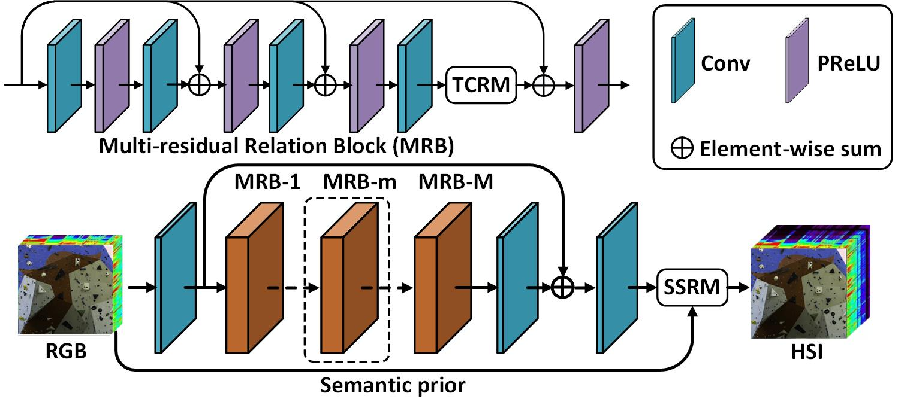

【**2023.12.12**】 The HPRN model havs been updated.

# HPRN: Holistic Prior-embedded Relation Network for Spectral Super-Resolution

Chaoxiong Wu, Jiaojiao Li, Rui Song, Yunsong Li, Qian Du. [Paper](https://ieeexplore.ieee.org/abstract/document/10091189). 

## HPRN framework
- Network architecture of the proposed network.

## Citation
- If the the work or the code is helpful, please cite the paper:  

@article{wu2023hprn,  
  title={Hprn: Holistic prior-embedded relation network for spectral super-resolution},  
  author={Wu, Chaoxiong and Li, Jiaojiao and Song, Rui and Li, Yunsong and Du, Qian},  
  journal={IEEE Transactions on Neural Networks and Learning Systems},  
  year={2023},  
  publisher={IEEE}  
}
 
